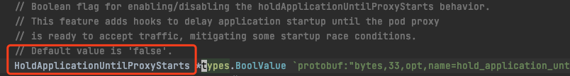
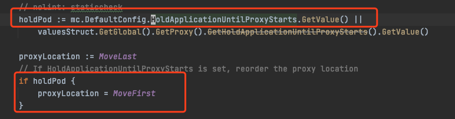

## 让 istio-injector 将 sidecar 注入到第一个 container

在 istio 1.7，社区通过给 istio-injector 注入逻辑增加一个顺序开关来解决了该问题，开关打开后，proxy 将会注入到第一个 container。





开关打开方法是配置 istio 的 configmap 全局配置:
``` bash
kubectl -n istio-system edit cm istio
```
在 `defaultConfig` 下加入 `holdApplicationUntilProxyStarts: true`
``` yaml
apiVersion: v1
data:
  mesh: |-
    defaultConfig:
      holdApplicationUntilProxyStarts: true
  meshNetworks: 'networks: {}'
kind: ConfigMap
```

若使用 IstioOperator，defaultConfig 修改 CR 字段 `meshConfig`:
``` yaml
apiVersion: install.istio.io/v1alpha1
kind: IstioOperator
metadata:
  namespace: istio-system
  name: example-istiocontrolplane
spec:
  meshConfig:
    defaultConfig:
      holdApplicationUntilProxyStarts: true
```

## 参考资料
* [Istio 运维实战系列（1）：应用容器对 Envoy Sidecar 的启动依赖问题](https://zhaohuabing.com/post/2020-09-05-istio-sidecar-dependency/#%E8%A7%A3%E5%86%B3%E6%96%B9%E6%A1%88)
* [PR: Allow users to delay application start until proxy is ready](https://github.com/istio/istio/pull/24737)