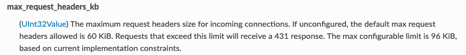

##  431: Request Header Fields Too Large

此状态码说明 http 请求 header 大小超限了，默认限制为 60 KiB，可以通过 EnvoyFilter 调整 `max_request_headers_kb` 字段，最大可调至 96 KiB



EnvoyFilter 示例 (istio 1.6 验证通过):
``` yaml
apiVersion: networking.istio.io/v1alpha3
kind: EnvoyFilter
metadata:
  name: max-header
  namespace: istio-system
spec:
  configPatches:
  - applyTo: NETWORK_FILTER
    match:
      context: ANY
      listener:
        filterChain:
          filter:
            name: "envoy.http_connection_manager"
    patch:
      operation: MERGE
      value:
        typed_config:
          "@type": "type.googleapis.com/envoy.config.filter.network.http_connection_manager.v2.HttpConnectionManager"
          max_request_headers_kb: 96
```

高版本兼容上面的 v2 配置，但建议用 v3 的 配置 (istio 1.8 验证通过):
``` yaml
apiVersion: networking.istio.io/v1alpha3
kind: EnvoyFilter
metadata:
  name: max-header
  namespace: istio-system
spec:
  configPatches:
  - applyTo: NETWORK_FILTER
    match:
      context: ANY
      listener:
        filterChain:
          filter:
            name: "envoy.http_connection_manager"
    patch:
      operation: MERGE
      value:
        typed_config:
          "@type": "type.googleapis.com/envoy.extensions.filters.network.http_connection_manager.v3.HttpConnectionManager"
          max_request_headers_kb: 96
```