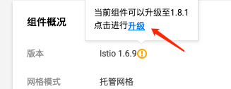
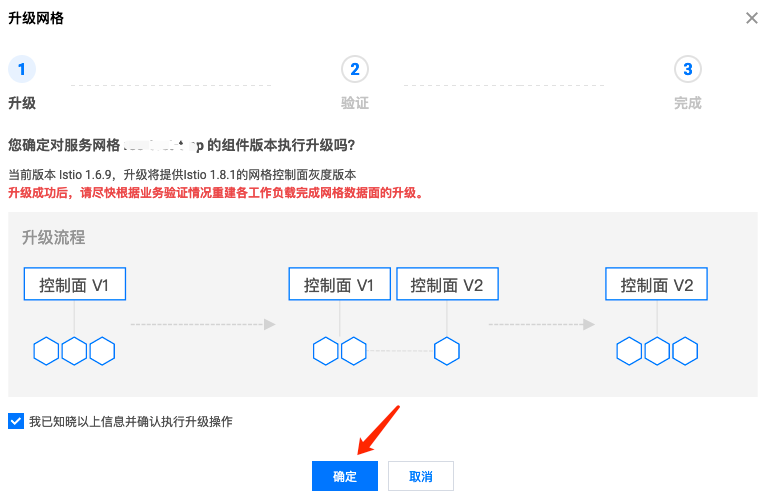
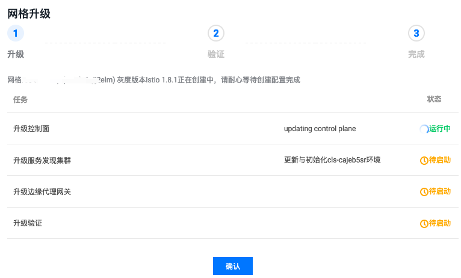
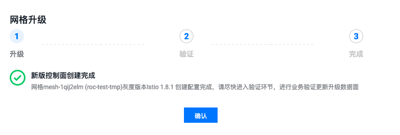
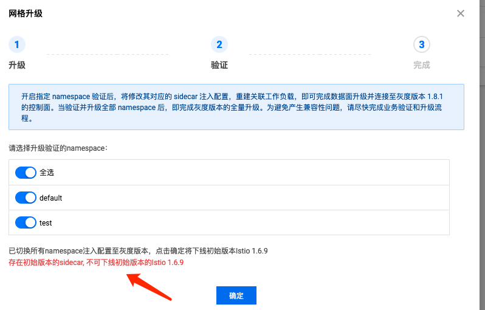
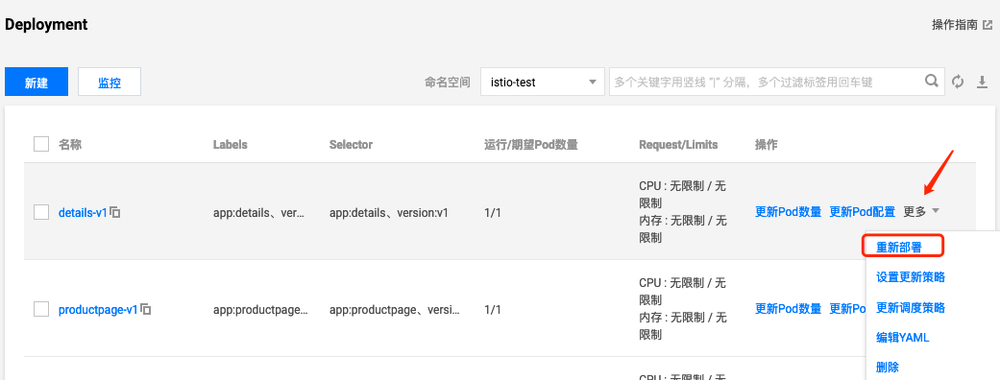
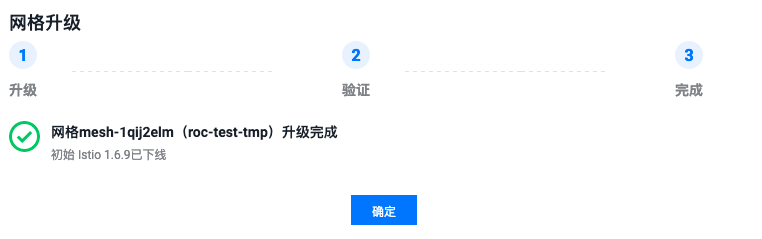

## 概述

TCM 升级采用灰度升级策略，首先会进行控制面升级，升级期间新旧控制面共存，直到数据面也完全升级完成才下掉旧的控制面，需要注意的是，数据面升级暂时需要手动重建带 sidecar 的 Pod，触发重新自动注入新版本 sidecar 来实现，本文介绍升级网格的步骤、注意事项与最佳实践。

## 找到升级入口

在网格基本信息页找到升级入口，点击【前往查看】:


点击【升级】:



## 升级控制面

勾选后点【确定】:



开始升级控制面:



新控制面一般很快创建完成，点【确定】即可:



## 升级数据面

接下来勾选要自动注入新数据面的命名空间，可以先尝试勾选一个命名空间，勾选之后该命名空间新建的 Pod 都会自动注入新的数据面 (sidecar)，然后就可以将该命名空间中之前已注入了旧数据面的 Pod (通常是全部) 进行重建，如此重复，直到所有命名空间都注入了新的数据面，就可以点【确定】了。

当集群内还存在旧版 Sidecar 的话，继续点击【确定】不会成功:



重建可以在 TKE 控制台点击 【重新部署】来触发滚动更新:



或者使用 kubectl 操作:

```bash
kubectl -n test rollout restart deployment/details-v1
```

如果工作负载太多，嫌挨个重启麻烦，评估批量重启对业务无风险后可以用脚本来实现批量重启(谨慎操作)，下面给出脚本示例:

* 滚动更新某个 namespace 下所有的 deployment:

```bash
kubectl -n test get deployments | grep -v NAME | awk '{print $1}' | xargs -I {} kubectl -n test rollout restart deployment/{}
```

> 替换 test 为需要批量升级数据面的 namespace 名称

* 滚动更新所有开启了自动注入的 namespace 的所有 deployment (风险高，建议只在测试环境中使用):

```bash
kubectl get namespace -l istio.io/rev | grep -v NAME | awk '{print $1}' | xargs -I {} bash -c "kubectl -n {} get deployment 2>/dev/null | sed '1d' | awk '{cmd=\"kubectl -n {} rollout restart deployment/\"\$1; system(cmd)}'"
```

## 升级完成

确认所有数据面升级完了之后再去点击前面的【确定】按钮，完成网格的升级:



## FAQ

### 升级期间是否影响新旧数据面之间的通信 ?

不会。升级期间，新旧数据面之间可以正常通信，因为下发的规则都是一样的，连接的新旧控制面使用的证书也是相同的。

### 升级过程发现一些问题，能否回滚 ？

如果没有完成全部升级，是可以回滚的。取消勾选指定的 namespace，该 namespace 中 Pod 重建后会自动注入旧的数据面，即回滚。如果要全部回滚，就全部取消勾选然后重建注入了新数据面的 Pod 即可。如果全部取消勾选，且点击了 【确定】，就表示下掉新控制面，彻底回滚到旧版本。