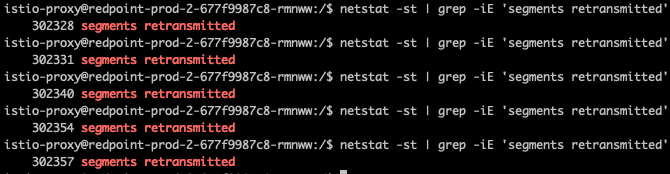

## 网络性能问题
现象:
* P99 延时高，部分请求响应较慢 (比如P95为10~20ms，P99中就有1~2s的请求)，去掉 sidecar 又比较快

思路:

* 看是否有丢包或者队列满之类的问题导致有重传(重传默认会等1s)

client 端看是否有重传:



## 检查是否有 conntrack 插入失败

watch:
``` bash
watch 'conntrack -S | awk -F "insert_failed=" "{print \$2}" | awk -F " " "{print \$1}" | awk "{sum += \$1} END {print sum}"'
```
执行一次:
``` bash
conntrack -S | awk -F 'insert_failed=' '{print $2}' | awk -F ' ' '{print $1}' | awk '{sum += $1} END {print sum}'
```
