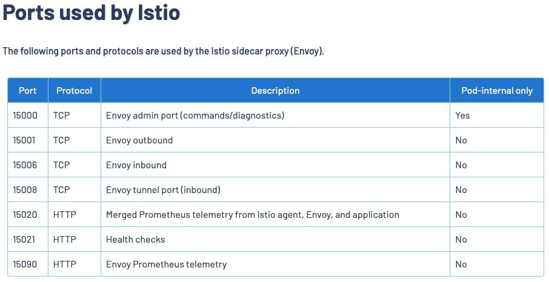

## 问题现象

所有新启动的 Pod 无法 ready，sidecar 报错:

```log
warning	envoy config	gRPC config for type.googleapis.com/envoy.config.listener.v3.Listener rejected: Error adding/updating listener(s) 0.0.0.0_15090: error adding listener: '0.0.0.0_15090' has duplicate address '0.0.0.0:15090' as existing listener
```

同时 istiod 也报错:

```log
ADS:LDS: ACK ERROR sidecar~172.18.0.185~reviews-v1-7d46f9dd-w5k8q.istio-test~istio-test.svc.cluster.local-20847 Internal:Error adding/updating listener(s) 0.0.0.0_15090: error adding listener: '0.0.0.0_15090' has duplicate address '0.0.0.0:15090' as existing listener
```

## 猜想

看报错应该是 sidecar 启动时获取 LDS 规则，istiod 发现 `0.0.0.0:15090` 这个监听重复了，属于异常现象，下发 xDS 规则就会失败，导致 sidecar 一直无法 ready。

## 分析 config_dump

随便找一个还未重启的正常 Pod，看一下 envoy config_dump:

```bash
kubectl exec debug-68b799694-n9q66 -c istio-proxy -- curl localhost:15000/config_dump
```

分析 json 发现 static 配置中有监听 `0.0.0.0:15090`:


## 定位原因

猜测是 dynamic 配置中也有 `0.0.0.0:15090` 的监听导致的冲突，而 dynamic 中监听来源通常是 Kubernetes 的服务发现(Service, ServiceEntry)，检查一下是否有 Service 监听 15090:

```bash
kubectl get service --all-namespaces -o yaml | grep 15090
```

最终发现确实有 Service 用到了 15090 端口，更改成其它端口即可恢复。

## 深入挖掘

搜索一下，可以发现 15090 端口是 istio 用于暴露 envoy prometheus 指标的端口，是 envoy 使用的端口之一:



> 参考 [Ports used by Istio](https://istio.io/latest/docs/ops/deployment/requirements/) 。

但并不是所有 envoy 使用的端口都被加入到 static 配置中的监听，只有 15090 和 15021 这两个端口在 static 配置中有监听，也验证了 Service 使用 15021 端口也会有相同的问题。

Service 使用其它 envoy 的端口不会造成 sidecar 不 ready 的问题，但至少要保证业务程序也不能去监听这些端口，因为会跟 envoy 冲突，istio 官网也说明了这一点: `To avoid port conflicts with sidecars, applications should not use any of the ports used by Envoy`。

## 使用建议

根据上面分析，得出以下使用建议:
1. Service/ServiceEntry 不能定义 15090 和 15021 端口，不然会导致 Pod 无法启动成功。
2. 业务进程不能监听 envoy 使用到的所有端口: 15000, 15001, 15006, 15008, 15020, 15021, 15090 。