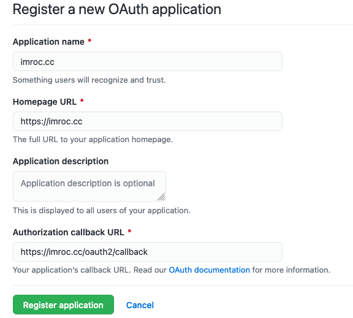
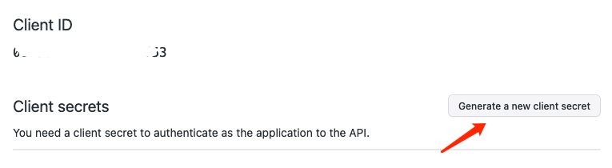
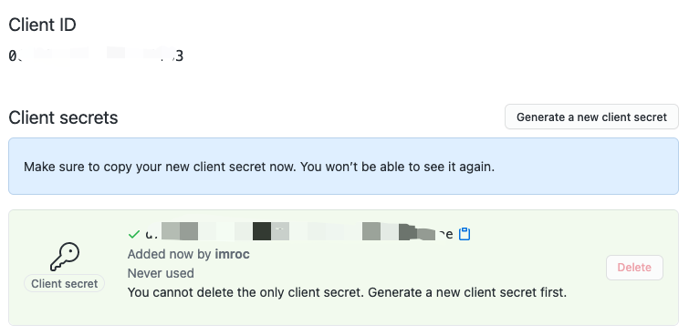

## 场景

在 [Developer settings](https://github.com/settings/developers) 中新建一个 OAuth App

## 参考资料

* [Istio OIDC Authentication](https://www.jetstack.io/blog/istio-oidc/)
* [oauth2-proxy 项目地址](https://github.com/oauth2-proxy/oauth2-proxy)
* [istio 1.9: Better External Authorization](https://istio.io/v1.9/blog/2021/better-external-authz/)
